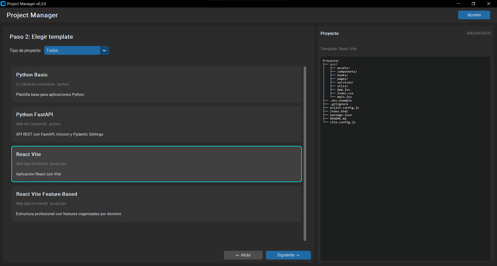
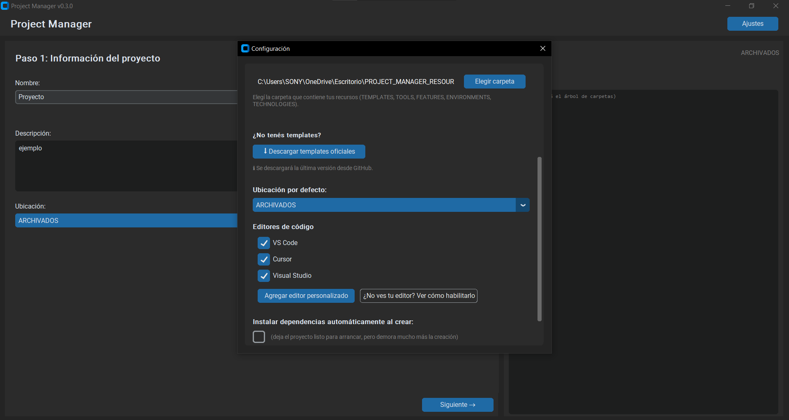
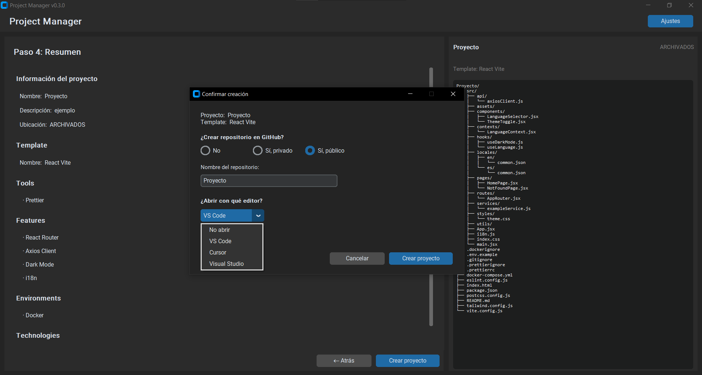
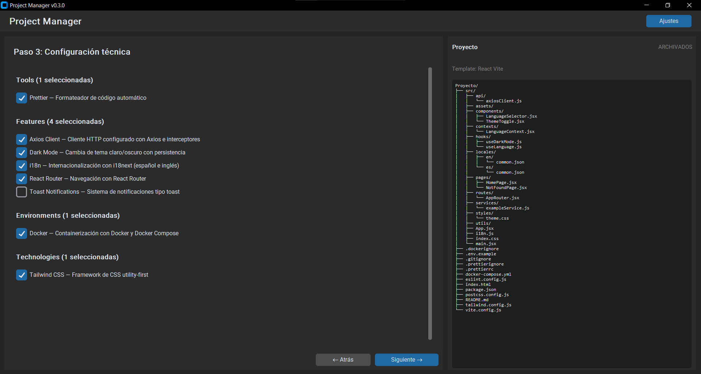

# Project Manager

Automatizá la creación de proyectos de programación a partir de
plantillas, herramientas y funcionalidades reutilizables.


## ✨ ¿Por qué usar Project Manager?

- **Ahorra tiempo:** creá la estructura completa de un proyecto en
  segundos. Sin crear carpetas a mano ni copiar archivos.
- **Ahorra tokens de IA:** cuando le pedís a ChatGPT/Claude que te
  arme la estructura de un proyecto, consume tokens. Project Manager
  lo hace localmente, gratis e instantáneo.
- **Consistencia:** todos tus proyectos empiezan con la misma
  estructura profesional.
- **Repositorios de GitHub automáticos:** si tenés `gh` CLI, podés
  crear el repo y pushear el proyecto con un click.
- **Multi-lenguaje:** Python, JavaScript, C# y más por venir.
- **Configurable:** agregá tus propios templates, tools, features,
  environments y technologies.

## 📋 Requisitos

- Windows 10 o superior (por ahora).
- Nada más si usás el ejecutable.

## 🚀 Cómo empezar

### Opción 1: Usar el ejecutable (recomendado)

1. Andá a [Releases](../../releases).
2. Descargá el último `ProjectManager-vX.Y.Z.zip`.
3. Descomprimí en una carpeta (por ejemplo,
   `C:\Program Files\ProjectManager`).
4. Creá un acceso directo al `ProjectManager.exe` en el escritorio.
5. Doble click para abrir.

**Ventajas:** No necesitás instalar Python ni nada.
**Desventajas:** No podés modificar el código.

### Opción 2: Clonar el repositorio

Si querés modificar el código, contribuir, o generar tu propio
ejecutable:

```bash
git clone https://github.com/maxi-hahn/project-manager.git
cd project-manager
pip install -r requirements.txt
python gui.py
```

**Ventajas:** Podés modificar el código y compilar tu propio `.exe`.
**Desventajas:** Necesitás Python instalado.

## 📖 Guía rápida

### Primer arranque

La primera vez que abras Project Manager, te va a pedir:

1. **Nombre:** tu nombre (para mostrarlo en la app).
2. **Carpeta de proyectos:** la carpeta donde vas a guardar tus
   proyectos. Debe contener subcarpetas (por ejemplo, `ACTIVOS`,
   `PERSONALES`, `ARCHIVADOS`). Cada subcarpeta será una ubicación
   donde se crearán tus proyectos.
3. **Carpeta de recursos:** la carpeta donde están tus templates,
   tools, features, etc. Debe contener las subcarpetas `TEMPLATES`,
   `TOOLS`, `FEATURES`, `ENVIRONMENTS`, `TECHNOLOGIES`.
4. **Ubicación por defecto:** cuál de las subcarpetas de proyectos
   querés usar por defecto.
5. **Editores de código:** cuáles usás (VS Code, Cursor, PyCharm,
   etc.).
6. **Instalar dependencias automáticamente:** si querés que se
   ejecute `npm install` o `pip install` al crear un proyecto.
   Desactivado por defecto (para creación rápida).



### Crear un proyecto

1. Click en "Crear proyecto".
2. **Paso 1:** nombre, descripción, ubicación.
3. **Paso 2:** template (podés filtrar por tipo de proyecto).
4. **Paso 3:** seleccioná Tools, Features, Environments, Technologies.
5. **Paso 4:** revisá el resumen.
6. Click en "Crear proyecto".

El árbol de carpetas a la derecha se actualiza en tiempo real,
mostrándote exactamente cómo va a quedar tu proyecto.



## 📁 Estructura de recursos

Project Manager busca los recursos en la carpeta que configures al
inicio. La estructura esperada es:

```
tu-carpeta-de-recursos/
├── TEMPLATES/
├── TOOLS/
├── FEATURES/
├── ENVIRONMENTS/
└── TECHNOLOGIES/
```

Cada recurso vive en una subcarpeta con un archivo de metadata
(`.json`) y opcionalmente una carpeta `files/` con los archivos a
copiar.

## 🛠️ Crear tu propio template

Para agregar un template:

1. Creá una carpeta dentro de `TEMPLATES/`. Por ejemplo:
   `TEMPLATES/CLI/MI_TEMPLATE/`.
2. Adentro, agregá los archivos base del proyecto.
3. Creá un archivo `template.json` con la metadata:

```json
{
    "name": "Mi Template",
    "category": "cli",
    "category_label": "CLI (línea de comandos)",
    "language": "python",
    "runtime": "python",
    "description": "Descripción del template",
    "version": "1.0.0"
}
```

**Campos:**

- `name`: nombre que se muestra en la GUI.
- `category`: categoría (`cli`, `web_api`, `web_app`, etc.).
- `category_label`: etiqueta amigable de la categoría.
- `language`: `python`, `javascript`, etc.
- `runtime`: `python` (crea `.venv`) o `node` (crea `node_modules`).
- `description`: descripción breve.
- `version`: versión del template.
- `requires` (opcional): lista de comandos requeridos en el PATH
  (por ejemplo, `["node"]`).

**Placeholders:** podés usar `{{PROJECT_NAME}}` y `{{DESCRIPTION}}`
en cualquier archivo de texto. Van a ser reemplazados al crear el
proyecto.



## 🔧 Solución de problemas

### "No se encontraron templates"

Verificá que la carpeta de recursos configurada contenga la subcarpeta
`TEMPLATES/` con al menos un `template.json`.

### "GitHub CLI no está instalado o autenticado"

Para crear repositorios automáticamente:

1. Instalá `gh` desde https://cli.github.com/.
2. Ejecutá `gh auth login` y seguí las instrucciones.
3. Reiniciá Project Manager.

### Mi editor no aparece en la lista

Algunos editores requieren habilitar el comando en la terminal:

- **PyCharm/WebStorm/IntelliJ:** `Tools → Create Command-line Launcher`.
- **Visual Studio:** agregar `Common7\IDE` al PATH.
- **Sublime Text:** agregar la carpeta de instalación al PATH.

Ver más detalles desde la GUI: Ajustes → Editores de código →
"Ver cómo habilitarlo".

## 🤝 Contribuir

¡Las contribuciones son bienvenidas!

- Reportá bugs en [Issues](../../issues).
- Sugerí features en [Issues](../../issues).
- Mandá Pull Requests.

## 🛠️ Para desarrolladores

### Instalar dependencias de desarrollo

```bash
pip install -r requirements-dev.txt
```

### Correr tests

```bash
python -m pytest
```

### Compilar el ejecutable

```bash
python -m PyInstaller --onedir --windowed --noconfirm --name "ProjectManager" --icon=assets/icon.ico gui.py
```

El ejecutable queda en `dist/ProjectManager/`.

### Releases automáticas

Al hacer `git push origin vX.Y.Z`, GitHub Actions compila el `.exe`
y lo publica automáticamente en Releases.

## 📄 Licencia

MIT — ver [LICENSE](LICENSE) para más detalles.

## 🗺️ Roadmap

- [x] CLI funcional.
- [x] GUI con wizard de 4 pasos.
- [x] Configuración persistente.
- [x] Árbol de carpetas en tiempo real.
- [x] Múltiples editores con detección.
- [x] Creación automática de repositorios en GitHub.
- [x] Ejecutable y releases automáticas.
- [x] Descarga de templates desde GitHub.
- [ ] Más templates (Next.js, C#, Vue).
- [ ] Más features (Authentication, File Upload).
- [ ] Página web de documentación.

---

Hecho con ❤️ por [Máximo Hahn](https://github.com/maxi-hahn).